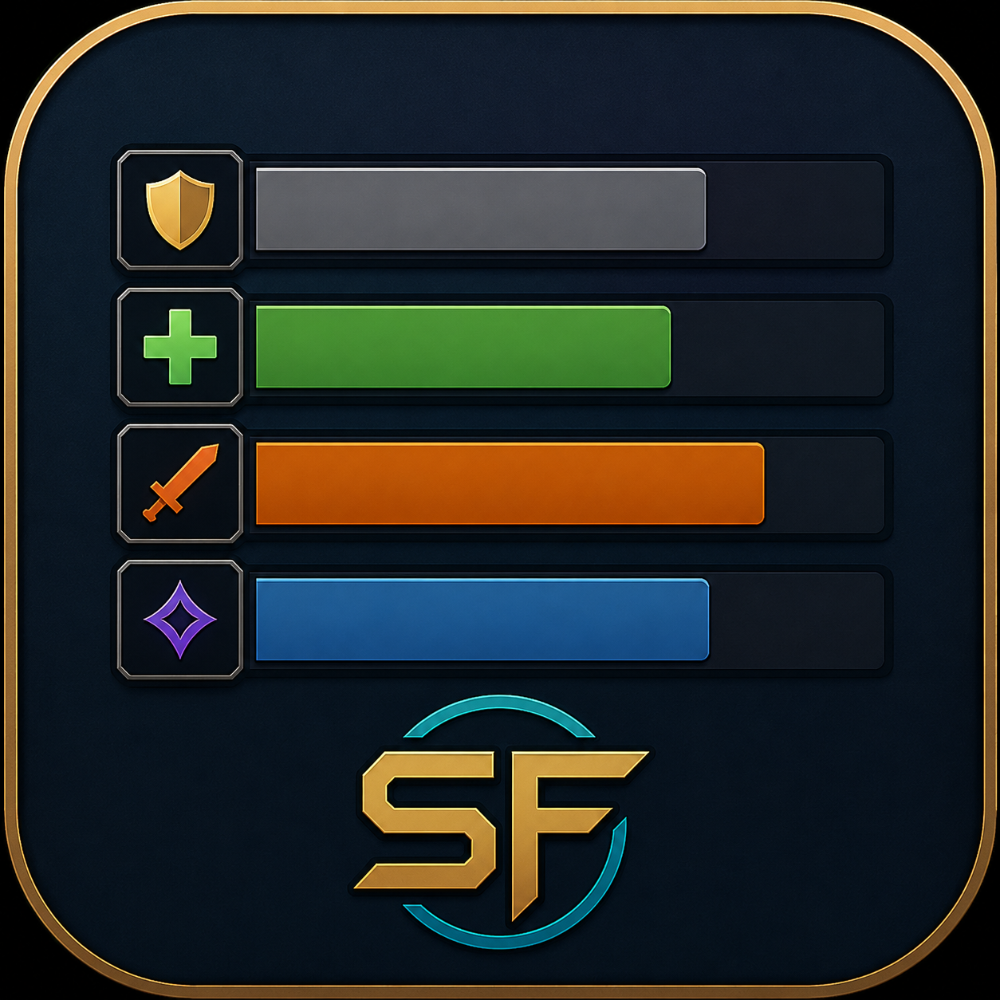

  

# SimpleFrames

Standalone Classic Anniversary TBC party and raid frames with secure click-casting, spell suggestions, priority targets, profiles, preview mode, and lightweight native options.

SimpleFrames is intentionally dependency-light. It does not embed Ace, LibStub, LibDataBroker, or other addon frameworks.

## Status

This project is a work in progress and is not yet a final release. Features, saved variables, and behavior may still change.

## Install

Copy the `SimpleFrames` folder into:

`World of Warcraft\_anniversary_\Interface\AddOns\SimpleFrames`

The addon TOC targets `## Interface: 20506`.

## Feature Breakdown

### Party And Raid Frames

- Shows the player while solo, party frames while grouped, and raid frames in raids.
- Uses secure unit buttons so targeting and click-casting work through protected WoW frame attributes.
- Middle click targets the clicked real unit by default.
- Layout and unit assignment changes are deferred while in combat.
- Blizzard party and raid frames can be hidden automatically.

| Solo frame | Solo frame with power and raid icon |
| --- | --- |
|  |  |

| Raid preview with groups and indicators |
| --- |
|  |

### Layout

- Adjustable frame width, frame height, spacing, and mana/power bar height.
- Raid groups can be arranged across configurable group columns.
- Unit direction can be vertical or horizontal.
- Raid group headers can be shown or hidden.
- Assigned Tank, DPS, and Healer roles show as icons to the left of party and raid frames when role data is available.
- Raid subgroups with assigned role data are split under their group header into Tank, DPS, Healer, and Other sections.
- Frames can be locked or unlocked.
- When unlocked, the main frame, Prio targets frame, and Pets frame can be dragged.

### Text

- Health text modes: percent, raw, raw + percent, or off.
- Mana/power text modes: percent, raw, raw + percent, or off.
- Name text can be upper-left or centered.
- Raid target icon visibility and size are adjustable.
- Name, health, and power font sizes are adjustable.
- Name, health, and power text offsets are adjustable, with horizontal offsets bounded by the current frame width.

### Auras And Indicators

- Aura display modes: buffs + debuffs, buffs only, debuffs only, or off.
- Configurable maximum buff and debuff icon counts.
- Buff and debuff icon sizes can be adjusted independently.
- Configurable low-health threshold.
- Optional stun and silence indicators.
- Buff and debuff icon positions can be adjusted, with horizontal offsets bounded by the current frame width.
- Debuff coloring is based on dispel type where available.
- Stun and silence detection is best-effort from visible auras and curated TBC spell IDs.

### Spells And Click-Casting

- Native click-casting is built into SimpleFrames without external libraries.
- Click-casting can be enabled or disabled from the **Spells** options tab.
- Supported bind keys:
  - `L`: Left click
  - `R`: Right click
  - `SL`: Shift + left click
  - `SR`: Shift + right click
  - `AL`: Alt + left click
  - `AR`: Alt + right click
- Bindings can be set from the **Spells** options tab or with `/sfr bind`.
- The **Spells** tab shows matching spellbook spells as you type.
- Click a spell suggestion or press Enter to pick the first visible match.
- If your character knows a resurrection spell, click-casts automatically use it on dead party or raid members. Blank left click also resurrects dead units.
- Blank right click bindings do nothing. Blank left click does nothing on living units, preserving default behavior.
- Middle click remains reserved for targeting.
- Spell binding changes are deferred while in combat.

Examples:

- `/sfr bind L Flash Heal`
- `/sfr bind SR Greater Heal`
- `/sfr bind R` clears right click.

### Prio Targets

- Shift + Middle Click a real party or raid unit to add or remove that unit from the separate **Prio targets** frame.
- The Prio targets frame uses the same visual style as the main frames.
- Prio target buttons use the same click-cast bindings as the main frames.
- The frame has its own saved position.
- Drag the frame by its title while SimpleFrames is unlocked.
- Use `/sfr prio clear` or the **Spells** tab to clear all prio targets.
- Prio targets are saved in the active profile and only show while those units are in the current party or raid.
- Priority changes are blocked while in combat when they would require protected updates.

### Pet Frame

- Party and raid pets appear in a separate **Pets** frame when pet units exist.
- The frame supports the player's pet, party pets, raid pets, and summoned demons through native WoW pet unit IDs.
- Pet buttons use the same click-cast bindings as the main frames.
- The frame has its own saved position and can be dragged by its title while SimpleFrames is unlocked.
- Pet frame visibility and column count are available from the **Layout** options tab.

### Profiles

- Active settings are saved per character in `SimpleFramesDB`.
- Reusable profiles are saved account-wide in `SimpleFramesProfilesDB`.
- Profiles include layout, text, aura, spell, pet frame, prio target, minimap, Blizzard UI, and frame position settings.
- Preview mode is not saved as active when capturing a profile.

### Preview Mode

- Party preview shows a simulated 5-player group.
- Raid preview shows a simulated 40-player raid.
- Preview health and power values can animate.
- Preview mode is useful for layout tuning without needing a group.
- Preview can be started from the options panel or slash commands.

| Animated raid preview |
| --- |
|  |

### Minimap Button

- Optional minimap button.
- Left click opens the options panel.
- Right click stops preview mode.
- The minimap button can be dragged around the minimap.

### Options Menu

The options panel is native UI and has no addon-library dependency.

- **General**: lock state, minimap button, frame/options reset, preview shortcuts, full reset, profiles.
- **Layout**: size, spacing, columns, unit direction, power bar, raid headers, pet frame controls.
- **Text**: health/power text modes, name placement, raid icons and raid icon size, font sizes, text offsets.
- **Auras**: aura mode, icon counts, icon sizes, low-health threshold, crowd-control indicators, icon offsets.
- **Spells**: click-cast enable toggle, bindings, spell suggestions, Prio targets enable/clear controls.
- **Blizzard UI**: hide or restore Blizzard party and raid frames.
- **Preview**: party preview, raid preview, preview off, animation toggle.

| General | Layout |
| --- | --- |
|  |  |

| Text | Auras |
| --- | --- |
|  |  |

| Spells | Blizzard UI |
| --- | --- |
|  |  |

| Preview |
| --- |
|  |

## Slash Commands

- `/sfr`, `/sframes`, `/simpleframes`, or `/simpleframe` opens the options panel.
- `/sfr options` or `/sfr config` also opens the options panel.
- `/sfr lock` locks frame movement.
- `/sfr unlock` unlocks frame movement.
- `/sfr test party` or `/sfr preview party` starts party preview.
- `/sfr test raid` or `/sfr preview raid` starts raid preview.
- `/sfr test off` or `/sfr preview off` stops preview.
- `/sfr reset` restores defaults.
- `/sfr hideblizzard` hides Blizzard party and raid frames.
- `/sfr showblizzard` restores Blizzard party and raid frames.
- `/sfr bind L|R|SL|SR|AL|AR <spell>` sets or clears a click-cast spell.
- `/sfr prio clear` or `/sfr prio reset` clears the Prio targets frame.
- `/sfr prio show` enables the Prio targets frame.
- `/sfr prio hide` disables the Prio targets frame.
- `/sfr priority ...` works as an alias for `/sfr prio ...`.
- `/sfr profiles` lists saved account-wide profiles.
- `/sfr profile save <name>` saves the current settings as a reusable profile.
- `/sfr profile load <name>` loads a saved profile on the current character.
- `/sfr profile delete <name>` or `/sfr profile remove <name>` deletes a saved profile.

`/sf` is used by some world-buff/Songflower addons. SimpleFrames only registers `/sf` if it is not already taken, so `/sfr` is the reliable short command.

## Combat Lockdown Notes

WoW restricts secure frame changes in combat. SimpleFrames follows those rules.

- Layout and roster assignment changes are queued until combat ends.
- Click-cast binding changes are queued until combat ends.
- Prio target display refreshes are queued when protected updates are required.
- Adding, removing, or clearing prio targets is blocked while in combat.
- Pet frame roster refreshes are queued until combat ends.

## Saved Variables

- `SimpleFramesDB`: per-character active settings.
- `SimpleFramesProfilesDB`: account-wide reusable profiles.

## Defaults At A Glance

- Frame width: `160`
- Frame height: `38`
- Power height: `10`
- Power bar: on
- Group columns: `5`
- Unit direction: vertical
- Raid headers: on
- Raid target icons: on
- Raid target icon size: `14`
- Health text: raw + percent
- Power text: raw + percent
- Aura mode: buffs + debuffs
- Buff icons: `2`
- Debuff icons: `3`
- Buff icon size: `12`
- Debuff icon size: `12`
- Low health threshold: `15%`
- Click-casting: enabled, with all spell bindings blank; left click auto-resurrects dead units if you know a resurrection spell
- Pet frame: enabled, one column
- Prio targets: enabled
- Minimap button: shown
- Hide Blizzard frames: enabled
